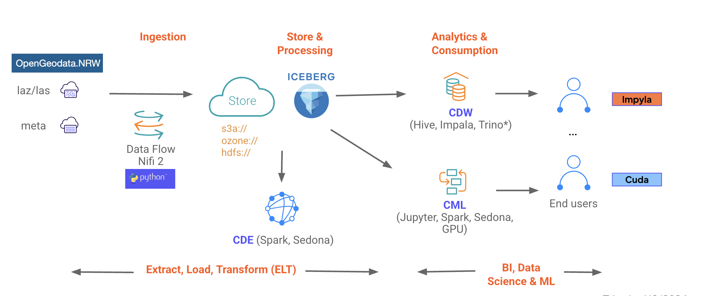

# Geospatial Workshop

Ingest, transform and analyse geospatial data

## Introduction

This workshop gives an overview of how to use the Cloudera quickly ingest data from remote sources, transform and explore raw data, create enriched and curated versions of the data for analyze, and then scale up.



## Compoments

Cloudera Machine Learning (CML) is Cloudera’s cloud-native machine learning platform built for CDP. Cloudera Machine Learning unifies self-service data science and data engineering in a single, portable service as part of an enterprise data cloud for multi-function analytics on data anywhere.

Cloudera Data Flow (CDF) data service powered by Apache NiFi that facilitates universal data distribution by streamlining the end-to-end process of data movement.

Cloudera Data Warehouse enables IT to deliver a cloud-native self-service analytic experience to BI analysts that goes from zero to query in minutes. It performs on all sizes and types of data, including structured and unstructured, while scaling cost-effectively past petabytes.

# Apache NiFi Flow Explanation: nifi2-demo-flow.json


This NiFi flow is designed to ingest LAZ (LAS Zip) files from an open geodata source, process them, and store them in both Amazon S3 and an Iceberg table. Here's a breakdown of the flow:

## Overview
The flow downloads 3D laser scanning data from North Rhine-Westphalia's open geodata portal, processes the LAZ files, converts them to CSV format, and stores them in cloud storage and a database table.

## Main Components

Create upfront the Iceberg table punktwolke - see   - run cdw/hive-punktwolke.sql on CDW / HUE


## NIFI Flow Processors

### 1. Data Retrieval
- **3D-Messdaten Laserscanning - Paketierung: Einzelkacheln** (InvokeHTTP processor)
  - Makes a GET request to `https://www.opengeodata.nrw.de/produkte/geobasis/hm/3dm_l_las/3dm_l_las/`
  - Retrieves the initial data listing (likely an XML file)

### 2. Data Processing Pipeline
- **Full list of download** (SplitXml processor)
  - Splits the XML response into individual elements (depth=4)

- **Eval LAZ files** (EvaluateXPath processor)
  - Extracts LAZ filenames using XPath expression `file/@name`

- **construct File URI** (ReplaceText processor)
  - Constructs full download URLs by combining the base URL with filenames
  - Uses expression `${invokehttp.request.url}/$1`

- **Prepare Download** (ExtractText processor)
  - Extracts the LAZ filename (`laz_file`) and URL (`url`) using regex patterns

- **Download File** (InvokeHTTP processor)
  - Downloads the actual LAZ files using the constructed URLs

### 3. Storage Paths
#### A. S3 Storage Path
- **Store in Cloud Storage S3** (PutS3Object processor)
  - Stores files in S3 bucket `goes-se-sandbox`
  - Path: `data/geospatial/nw/${laz_file}`
  - Uses AWS credentials from parameter context
  - Auto-terminates on success, routes failures to funnel

#### B. Iceberg Table Path
- **LazToCsvProcessor** (Custom Python processor)
  - Converts LAZ files to CSV format
  - Processes in chunks (10,000 records) with max 100,000 records

- **Store in Iceberg Table PUNKTWOLKE** (PutIceberg processor)
  - Stores data in Iceberg table `punktwolke` in `geospatial` namespace
  - Uses HiveCatalogService for catalog management
  - File format: PARQUET
  - Uses Kerberos authentication (user: frothkoetter)
  - Auto-terminates on success, routes failures to funnel

### 4. Supporting Components
- **Controller Services**:
  - HiveCatalogService: Manages Iceberg catalog
  - CSVReader: Reads CSV data
  - KerberosPasswordUserService: Handles Kerberos auth
  - AWSCredentialsProviderControllerService: Manages AWS credentials

- **Parameter Context** (`lidar_nw`):
  - Contains sensitive credentials and configuration
  - AWS access keys
  - S3 bucket/path configuration
  - CDP environment files
  - Kerberos credentials

### 5. Error Handling
- Multiple connections route failures to funnels
- Backpressure settings (10,000 objects or 1GB) prevent overload
- Retry count set to 10 for processors

## Flow Execution Path
1. Retrieve XML listing of available files
2. Split XML into individual file entries
3. Extract LAZ filenames and construct full URLs
4. Download each LAZ file
5. Store original LAZ files in S3
6. Convert LAZ to CSV
7. Store CSV data in Iceberg table

This flow appears to be part of a geospatial data pipeline, processing 3D laser scanning data for storage and analysis in a data lake environment.


## Nifi 2 Python Transformer

This custom NiFi 2 Python processor (`LazToCsvProcessor`) is designed to **convert `.laz` point cloud files into CSV format**. It uses the `laspy`, `lazrs`, and `numpy` libraries to read, process, and transform LiDAR point data.

Here's a high-level explanation of how it works:

---

### 🔧 **Purpose**

Convert `.laz` (compressed LiDAR data) binary file content into CSV rows with selected attributes: `x`, `y`, `z`, `intensity`, `return number`, and `classification`.

---

### 📦 **Key Libraries Used**

* **`laspy` + `lazrs`**: Read compressed `.laz` LiDAR files.
* **`numpy`**: Efficient handling of structured array data.
* **`io.StringIO`**: Temporarily buffer CSV output in-memory.
* **`tempfile`**: Temporarily write `.laz` file content for `laspy` to read.

---

### 🧩 **Core Components**

#### **1. Processor Configuration**

Defined in the `ProcessorDetails` class:

```python
version = '0.0.6'
description = 'Reads a .laz file from FlowFile content and converts it to CSV.'
```

#### **2. Custom Properties**

Two optional tunables:

* `Max Records`: Total points to process (default: 100,000).
* `Chunk Records`: Sub-chunk size (default: 10,000) to avoid high memory use.

#### **3. Main Transformation Logic**

Occurs in the `transform` method:

1. **Read .laz File Content** from FlowFile as binary.
2. **Write to Temporary File** so that `laspy` can open it.
3. **Open with `laspy.open`** using the `lazrs` backend.
4. **Iterate Over Chunks**:

   * For each chunk:

     * Sub-divide into smaller "chunk records" to manage memory.
     * Convert each mini-chunk to a structured NumPy array.
     * Write CSV rows (`x, y, z, intensity, return_num, classification`) to an in-memory buffer.
5. **Cleanup**: Delete the temporary `.laz` file.
6. **Return a New FlowFile** with:

   * Content: CSV string as bytes.
   * Attributes: `laz.converted=true`, `point.count=N`.
   * Relationship: `success`.

#### **4. Error Handling**

* If anything fails (e.g. empty input, parsing issues), return `relationship='failure'` and capture the error message as a FlowFile attribute.

---

### ✅ **Success Case**

If `.laz` file is valid:

* FlowFile content becomes a CSV.
* Attributes added:

  * `"laz.converted": "true"`
  * `"point.count": "XXXXX"`
* Routed to `success`.

### ❌ **Failure Case**

* If error occurs (invalid file, empty, etc.), return:

  * FlowFile with error message as content.
  * Attribute: `"error": "..."`.
  * Routed to `failure`.

---

### 🗺️ Example Output (CSV)

```
x,y,z,intensity,return_num,classification
123.45,678.90,100.23,45,1,2
...
```

---

### 🧠 Summary

This is a clean, efficient NiFi 2 processor for LiDAR preprocessing pipelines, converting binary `.laz` data into structured, consumable CSV format—ideal for downstream analytics or GIS tools.

Would you like a diagram or sample input/output to go with this explanation?

# CML - Geospatial Data Pipeline : LAZ-to-Iceberg.py

This Python script is a geospatial data pipeline that performs the following end-to-end operations:

This Python script is a **geospatial data pipeline** that performs the following **end-to-end operations**:

---

## 🧭 **High-Level Goal**

Download **LAZ files** (compressed LiDAR point clouds) from **AWS S3**, extract LiDAR point attributes, **transform the data**, and **store it in a Hive table (Iceberg format)** using **Apache Spark**.

---

## 🧱 **High-Level Workflow**

1. **Connect to S3** and find `.laz` files matching a pattern.
2. **Download and read** the `.laz` files using `laspy`.
3. **Extract point data** (x, y, z, intensity, etc.).
4. **Convert coordinates** (UTM to lat/lon using `pyproj`).
5. **Encode geohashes** (optional spatial indexing).
6. **Create Spark DataFrames**, append `source_file` as metadata.
7. **Write data into Hive (Iceberg) tables** partitioned by file.
8. **Repeat for all files**, then stop Spark session.

---

## 🔍 **Step-by-Step Breakdown**

### 1. 📦 **Imports and Requirements**

* Uses `laspy`, `boto3`, `pyproj`, `geohash2`, `Spark`, and `cmldata` (Cloudera ML SDK).
* `cudf` and GPU acceleration are commented out but hinted at.

---

### 2. 🌍 **Coordinate Transformation**

```python
transformer = pyproj.Transformer.from_crs("EPSG:25832", "EPSG:4326", always_xy=True)
```

* Converts from UTM zone 32N (EPSG:25832) to WGS84 lat/lon (EPSG:4326).

---

### 3. 📡 **S3 Setup**

* Lists objects in the bucket `goes-se-sandbox` under prefix `data/geospatial/nw/`.
* Filters for filenames matching: `*3dm_32_283*.laz`.

---

### 4. 📥 **Download Matching LAZ Files**

```python
for file_key in tqdm(laz_files):
    s3_client.get_object(Bucket=..., Key=...)
```

* Each file is downloaded (as binary) from S3.
* Intended to be written locally (commented out).
* Tracks file size and logs downloads.

---

### 5. 💡 **Spark Setup**

```python
spark.sql("CREATE DATABASE IF NOT EXISTS geospatial")
```

* Configures Spark via Cloudera ML (`cmldata.get_connection(...)`).
* Creates Hive database and Iceberg table:

  * Schema: `x, y, z, intensity, return_num, classification`
  * Partitioned by: `source_file`
  * Format: `Parquet + Iceberg`, compression: `Snappy`

---

### 6. 🧪 **Processing Each LAZ File**

```python
las = laspy.open(io.BytesIO(binary_data)).read()
```

* Reads each `.laz` file using `laspy`.
* Extracts individual LiDAR attributes:

  * `x`, `y`, `z`, `intensity`, `return_number`, `classification`
* Builds a list of points.

---

### 7. 🔄 **Create Spark DataFrame**

```python
df = spark.createDataFrame(point_data, schema=schema)
```

* Builds a DataFrame with extracted points.
* Adds `source_file` as a new column.
* Inserts data into Hive (Iceberg) table.

---

### 8. 🧊 **Iceberg Table Insert**

```sql
INSERT INTO TABLE geospatial.point_cloud SELECT * FROM temp_points
```

* Data written in partitions based on file.
* Ensures scalability, spatial filtering, and easy downstream querying.

---

### 🧪 Optional/Unfinished Features

* **Geohashing**: Logic to convert lat/lon to geohash is present but not actively used.

---


## ✅ **Final Output**

* All matched `.laz` files from S3 are processed.
* Their point data is converted into structured Spark rows.
* Data is stored in a **partitioned, queryable Iceberg Hive table** in the `geospatial` database.

---


# Cloudera AI - Sedona Examples : ApacheSedonaSQL.ipynb ApacheSedonaCore.ipynb

These examples are from Apache Sedona documentation

https://github.com/apache/sedona/tree/master/docs/usecases

# Cloudera AI - NVIDIA Rapids rapids-gpu.ipynb
Nvidia cuML, cuDF and cuSpatial

This code snippert processes raw data into an NVIDIA GPU DataFrame (cuDF)

```Python
import cudf
import laspy
import lazrs
import numpy as np

def process_las_to_cudf(file_path):
    with laspy.open(file_path) as las:
        las = las.read()
        return cudf.DataFrame({
            'x': cudf.Series(las.x, dtype='float64'),
            'y': cudf.Series(las.y, dtype='float64'),
            'z': cudf.Series(las.z, dtype='float64'),
            'intensity': cudf.Series(np.asarray(las.intensity), dtype='int32'),
            'return_num': cudf.Series(np.asarray(las.return_number), dtype='int32'),
            'classification': cudf.Series(np.asarray(las.classification), dtype='int32')
        })

# Process file

gdf = process_las_to_cudf(local_path)
```

### Show results
```Python
print(gdf.head())
print(f"Number of points: {len(gdf)}")
```
| x         | y         | z    | intensity | return_num | classification |
|-----------|-----------|------|-----------|------------|----------------|
| 280000.00 | 5652013.19 | 59.88 | 41571    | 1          | 2              |
| 280000.00 | 5652013.48 | 59.93 | 45066    | 1          | 2              |
| 280000.32 | 5652013.23 | 59.89 | 40981    | 1          | 2              |
| 280000.59 | 5652013.26 | 59.88 | 40959    | 1          | 2              |
| 280000.32 | 5652013.52 | 60.06 | 45284    | 1          | 20             |

Number of points: 15,787,378

A quick plot show the result


# Cloudera Data Warehouse

Hive with Spatial Extensions available in PC CDW (check ESRI Extension)

```sql
show functions like 'st%'
```
Output must list available geospatial functions available for your SQL.

|st_aggr_convexhull|
|st_aggr_union |
|st_area |
...


# Spatial Query Explanation: Point Cloud Analysis - Script: cdw-analyse/hive-geospatial.SQL

```sql
WITH bounds AS (
  SELECT ST_GeomFromText(
    'POLYGON((280000 5626000, 280000 5747500, 288500 5747500, 288500 5626000, 280000 5626000))'
  ) AS region_geom
)
SELECT
  COUNT(*) AS total_points,
  COUNT(IF(classification = 2, 1, NULL)) AS ground_points,
  MIN(z) AS min_z,
  MAX(z) AS max_z,
  AVG(z) AS avg_z
FROM punktwolke AS lp
JOIN bounds AS b
  ON ST_Contains(b.region_geom,
           ST_Point(lp.x, lp.y));
```

This SQL query performs a spatial analysis on point cloud data (likely LiDAR data) within a specific geographic bounding box. The query **counts and analyzes points** that fall within a defined rectangular region, specifically focusing on:
- Total point count
- Ground-classified points (classification = 2)
- Elevation statistics (min, max, average Z values)


**Spatial Bounding Box Definition** (CTE named `bounds`):
   ```sql
   SELECT ST_GeomFromText('POLYGON((280000 5626000, 280000 5747500, 288500 5747500, 288500 5626000, 280000 5626000))') AS region_geom
   ```
   - Creates a polygon in UTM coordinates (likely EPSG:25832 for Germany)
   - Defines a rectangular area ~8.5km wide (east-west) and ~121.5km tall (north-south)

**Spatial Join Condition**:
   ```sql
   ON ST_Contains(b.region_geom, ST_Point(lp.x, lp.y))
   ```
   - Uses `ST_Contains` to filter points inside the bounding box
   - Converts raw X/Y coordinates to spatial points with `ST_Point`

**Point Cloud Metrics**:
   - `COUNT(*)` - Total points in the area
   - `COUNT(IF(classification = 2, 1, NULL))` - Count of ground points (LAS classification standard)
   - `MIN(z)/MAX(z)/AVG(z)` - Elevation statistics

This type of query is essential for:
- Terrain modeling (using ground points)
- Calculating vegetation height (canopy - ground)
- Infrastructure planning
- Flood risk analysis (via elevation stats)

## SQL Script Explanation: Geospatial Metadata Processing - Script: cdw-analyse/hive-metadata.SQL

This script processes geospatial metadata from North Rhine-Westphalia's open geodata portal, transforming raw CSV data into an optimized Iceberg table format. Here's the high-level breakdown:

### Raw Data Ingestion (Phase 1)
- **Source**: CSV files from https://www.opengeodata.nrw.de (3D point cloud metadata)
- **External Table Creation**:
  - Creates `tile_metadata` table pointing to S3 location `/data/geospatial/nw/tile_metadata`
  - Handles German column names (Kachelname = tile name, Aktualitaet = currency date)
  - Skips 7 header rows from the CSV (`skip.header.line.count="7"`)
  - Uses semicolon delimiters (common in German data formats)

### Data Curation (Phase 2)
- **Iceberg Table Creation**:
  - Creates `tile_metadata_ice` with enhanced schema:
    - Adds default values for German state info (`Land = "Nordrhein-Westfalen"`)
    - Includes ownership details (`Eigentuemer`)
    - Standardizes versioning (`Version_Standard = "1.2"`)
    - Documents point cloud classifications (`Punkteklassenbelegung`)
  - Uses Iceberg format for advanced features (time travel, schema evolution)

- **Data Transformation**:
  - Appends `.laz` extension to tile names (LASzip format)
  - Preserves original metadata columns while adding contextual defaults
  - Converts raw CSV data into a production-ready format

### Analytics (Phase 3)
- **Cross-Table Analysis**:
  - Joins metadata with `point_cloud_part` table (assumed to contain actual point cloud data)
  - Aggregates point counts by:
    - Geographic region (`land`)
    - Source file (`source_file`)
    - Geohash (spatial indexing)

- **Query Patterns**:
  - Simple metadata inspection (`SELECT * FROM tile_metadata_ice`)
  - Spatial distribution analysis (geohash-based counts)

### Key Technical Aspects
**Data Lake Architecture**:
   - Raw → Curated pipeline pattern
   - External tables for raw data, managed tables for production

**Geospatial Specifics**:
   - Handles German coordinate reference systems (CRS)
   - Manages point cloud resolution values (Aufloesung)
   - Tracks data currency (Aktualitaet)

**Performance Considerations**:
   - Iceberg format enables efficient point cloud metadata queries
   - Geohash aggregation supports spatial analytics

This script represents a complete ETL pipeline for German governmental geospatial data, from raw ingestion to analytical-ready format.
